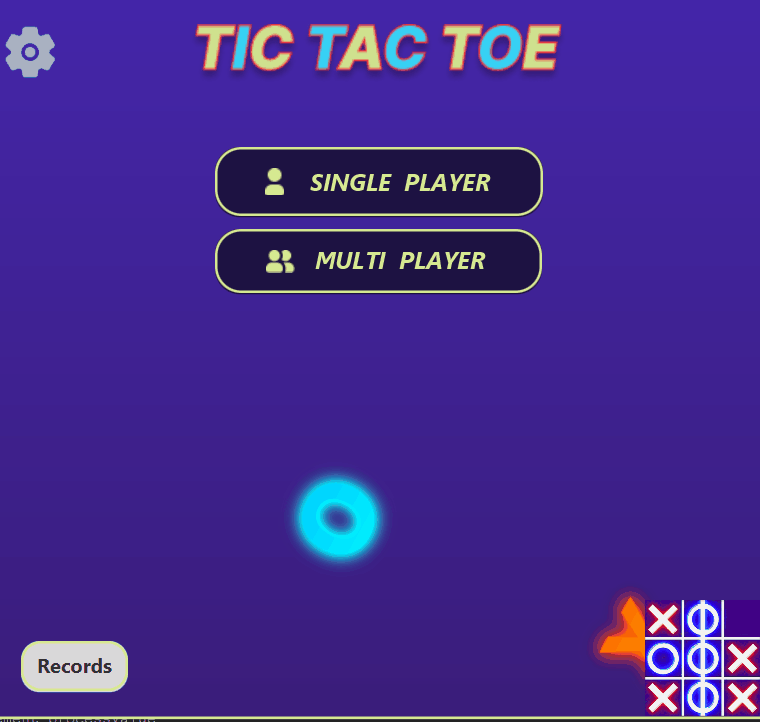

## MAD46_TicTacToeClient – JavaFX Multiplayer & Single Player Tic-Tac-Toe

A desktop Tic-Tac-Toe game developed as the Java project for ITI Intake 46 by students in the Mobile Application Development track - MAD .

### How to Run:

#### Make sure you have:

* TicTacToe Server : https://github.com/Alaa7Hany/MAD46_Tic-Tac-Toe_Server   -- For playing online

* TicTacToe Shared Library : https://github.com/Alaa7Hany/MAD46_Tic-Tac-Toe_Shared

#### Run Client

* Open project in IDE
* Make sure JavaFX libraries are configured
* Run App.main()

#### For playing Online:

* Open server project 
* Run its main class and start the Server

### Features:
* login
* SignUp
* record games
* play with online friends
* play with pc with 3 difficulty levels
* play with a friend in the same machine 
* play and stop background music
* show the total users , online and offline at the server side

Dont forget to have fun ^ ^

ITI_MAD46_ISM
